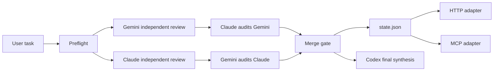

# AgentParty / triparty Framework

AgentParty is a productizable multi-agent protocol for repeatable agent workflows.
`triparty` is the first productized AgentParty pack: verifiable Codex + Claude + Gemini collaboration with source checks, cross-audit, and release gates.

This project prevents two common failure modes in AI-agent work:

- A single model claims to have used several models, but there is no source trail, no independent review, and no cross-audit.
- The same skill is copied between agent runtimes, but quality drops because context, tools, memory, auth, and output gates differ.

AgentParty makes agent roles, evidence, product-pack boundaries, and completion claims explicit. The current executable pack, `triparty`, turns Codex + Claude + Gemini collaboration into an executable workflow with source checks, archived model outputs, mutual audits, and a merge gate before synthesis.

Repository: https://github.com/r-design-j/tri-party-framework

Download ZIP: https://github.com/r-design-j/tri-party-framework/archive/refs/heads/main.zip

公开网页工具：https://r-design-j.github.io/tri-party-framework/


## Product Shape

| Layer | Current status | Meaning |
| --- | --- | --- |
| AgentParty protocol | Scaffolded | Generic multi-agent contracts, pack registry, skill portability rules, OS matrix |
| `triparty` pack | Productized | Codex + Claude + Gemini with `true_triparty_ready` release gate |
| Claude Code + Feishu Claw pack | Scaffolded | 2-agent workflow for Claude Code and Feishu Claw transcripts; never true tri-party |

Core AgentParty files:

- `docs/framework/agentparty-protocol.md`
- `docs/framework/agentparty-packs.json`
- `docs/framework/product-packs/triparty.md`
- `docs/framework/product-packs/claude-code-feishu-claw.md`
- `docs/framework/agentparty-managed-install-lifecycle.md`
- `scripts/agentparty.py`
- `scripts/agentparty-pack-lint.py`

AgentParty commands:

```bash
scripts/agentparty.sh packs
scripts/agentparty.sh info --pack triparty
scripts/agentparty.sh info --pack claude-code-feishu-claw
scripts/agentparty.sh doctor
scripts/agentparty.sh onboard --pack triparty --target-os auto
scripts/agentparty.sh install --pack triparty --target-os auto
scripts/agentparty.sh install --pack triparty --target-os auto --execute
scripts/agentparty.sh install-plan --pack triparty --target-os auto
scripts/agentparty.sh install-plan --pack triparty --target-os windows_powershell
scripts/agentparty.sh quickstart --pack triparty --target-os auto
scripts/agentparty.sh quickstart --pack claude-code-feishu-claw --target-os auto
scripts/agentparty.sh release-check
scripts/agentparty.sh release-check --full --triparty-run-dir docs/framework/runs/review-YYYYMMDD-HHMMSS
scripts/agentparty.sh package --out dist/agentparty-release --archive
scripts/agentparty.sh prompt --pack claude-code-feishu-claw --task "整理飞书文档"
scripts/agentparty.sh kit --pack claude-code-feishu-claw --task "整理飞书文档" --out claw-kit
scripts/agentparty.sh bridge-kit --pack claude-code-feishu-claw --task "整理飞书文档" --out claw-bridge
scripts/agentparty.sh bridge-validate --bridge-dir claw-bridge
scripts/agentparty.sh run --pack claude-code-feishu-claw --task "整理飞书文档"
scripts/agentparty.sh evidence-template --pack claude-code-feishu-claw --run-dir "<run-dir>" --out claw-evidence
scripts/agentparty.sh evidence-fill --pack claude-code-feishu-claw --bundle claw-evidence/agentparty-claw-evidence.json --feishu-link "<飞书链接>"
scripts/agentparty.sh evidence --pack claude-code-feishu-claw --bundle claw-evidence/agentparty-claw-evidence.json
scripts/agentparty.sh validate-run --run-dir "<run-dir>"
scripts/agentparty.sh guide --pack claude-code-feishu-claw --run-dir "<run-dir>"
scripts/agentparty.sh claw-e2e --pack claude-code-feishu-claw --task "创建一个 AgentParty 测试文档" --out claw-e2e-run
scripts/agentparty.sh run --pack triparty --task "审查这个方案"
```

`agentparty onboard --pack triparty` is the productized first-use surface for the TriParty pack. It shows the current OS path, readiness checks, install/preflight/first-run/release-gate steps, and the one-copy prompt to hand to another local agent. It does not run models or upgrade probe success into completion. `agentparty quickstart --pack ...` prints a shorter install/use path and an agent delegation prompt for the selected pack and OS target. `agentparty kit --pack claude-code-feishu-claw` creates a reusable local Claw handoff kit with `START_HERE.md`, Claude Code prompt, Feishu Claw prompt, action request, initial `state.json`, and an evidence bundle in one directory. It writes local files only and does not call Feishu or import evidence. `agentparty bridge-kit --pack claude-code-feishu-claw` is the target-shape scaffold: Feishu Claw is the user-facing intake/report surface, Claude Code is a controlled runner, and both sides share file-backed resources plus bridge state with one-active-writer and mutual-review rules. `bridge-validate` validates that bridge state without claiming native Feishu Claw callback support. `START_HERE.md` is the first page for ordinary users: copy order, evidence checklist, import commands, and boundaries. `agentparty run --pack claude-code-feishu-claw` creates a pack-scoped run with Claude Code and Feishu Claw prompts plus `agentparty.pack-state.v1`. Both start as `partial` until Feishu Claw transcript, Feishu link, operation summary, and Claude review evidence are imported. `agentparty guide --pack claude-code-feishu-claw --run-dir ...` reads the current state and prints the next command for `partial`, `blocked`, `scoped`, or `pack_ready` runs. `agentparty evidence-template` creates a fill-in bundle so users can hand the same evidence shape between Claude Code and Feishu Claw; `agentparty evidence-fill` updates that local bundle without calling Feishu, importing evidence, or changing `state.json`; `agentparty evidence --bundle ...` imports it. `agentparty claw-e2e --pack claude-code-feishu-claw` runs the scoped local E2E adapter: Claude Code plan/review, Feishu CLI docx create/fetch, evidence import, and validation. It can produce `pack_ready` without manual transcript copy/paste, but it is not native Feishu Claw connector automation. With complete evidence the pack can become `pack_ready`; it still keeps `true_triparty_ready=false`.

`agentparty release-check` is the AgentParty productization gate before commit or release packaging. Quick mode checks Python syntax, pack registry lint, triparty lint, `git diff --check`, website anchors, and the exact website command-card copy commands. `--full` adds the complete regression suite; `--triparty-run-dir` also runs the triparty release gate for a completed review run.

`agentparty package --out <dir> --archive` creates a read-only AgentParty release bundle with protocol docs, pack registry, product-pack docs, adapters, installer/uninstaller scripts, website files, an `INSTALL.md`, and `agentparty-package-manifest.json` with file hashes and pack boundaries. Packaging is a distribution surface only; it does not install global files, execute model workflows, claim native PowerShell execution, or automate Feishu Claw auth.

`.github/workflows/agentparty-release.yml` turns that local gate into repeatable release artifacts:

- Ubuntu and macOS jobs run `scripts/agentparty.sh release-check --full --json`, then build and upload `agentparty package` bundles.
- The Windows job runs the native PowerShell package path as a supported read-only distribution surface, then asserts `install --execute`, `run`, `doctor --deep`, `evidence`, and `claw-e2e` emit `E_BLOCKED_OS` plus the WSL2 handoff.
- The workflow must not run model workflows or claim native PowerShell execution.

## What triparty Does

- Runs a preflight check for Codex, Claude, and Gemini availability.
- Collects independent Claude and Gemini review artifacts.
- Forces mutual cross-audit: Claude audits Gemini, Gemini audits Claude.
- Blocks final synthesis until the merge gate verifies source status, artifact metadata, completion markers, and hashes.
- Writes a machine-readable `state.json` with preflight binary evidence, provenance, Gemini diagnostics, and schema validation for UI, HTTP, MCP, CI, or external adapters.
- Provides a release gate that rechecks merge readiness, state shape, artifact hashes, automated provenance, and runtime-noise cleanliness before public release claims.
- Supports offline injection when Claude or Gemini output was collected manually.
- Provides HTTP and MCP adapters without changing the portable core truth.

## Why It Exists

Multi-agent work is useful only when the sources are real. If an agent cannot prove where each party's input came from, the result is not a true multi-model review.

Tri-party Framework makes this explicit:

- Codex owns implementation, repository work, tests, and final synthesis.
- Claude owns complex reasoning, architecture critique, and long-chain review.
- Gemini owns multimodal, URL, Google-context, and broad-context review.

Codex sub-agents do not count as Claude or Gemini.

## 本地安装

如果你想让 AI agent 直接处理安装，可以把下面这段话发给 Codex、Claude Code、Gemini CLI 或其他能操作本机终端的 agent：

```text
请在这台机器上安装 triparty。
目标仓库：https://github.com/r-design-j/tri-party-framework
执行要求：
先判断系统环境：macOS / Linux / Windows WSL2 可按当前流程执行；Windows 原生 PowerShell/CMD 目前只做环境准备和检查，不要硬跑 bash 脚本，请引导进入 WSL2 或等待 PowerShell 原生 AgentParty CLI 路线完成。
1. clone 仓库并进入目录。
2. 补齐必要脚本权限。
3. 运行项目自检。
4. 安装全局发现规则和 triparty 命令。
5. 运行 triparty preflight 验证。
6. 如果缺少 Claude Code、Gemini CLI、认证或权限，请明确报告缺失项；不要把 partial run / 未完成协作说成 true tri-party / 完整三方。
完成后告诉我本机安装路径和 preflight 结果。
```

先 clone 框架并跑本地检查：

```bash
# 适用 macOS / Linux / Windows WSL2；PowerShell 原生路线仍在 AgentParty 通用层中。
git clone https://github.com/r-design-j/tri-party-framework.git
cd tri-party-framework
chmod +x scripts/*.sh adapters/http/triparty_http_adapter.py adapters/mcp/triparty_mcp_adapter.py
scripts/triparty-lint.sh
```

Windows 原生 PowerShell/CMD/Git Bash/MSYS/Cygwin 当前不要直接运行 `scripts/*.sh`。推荐先进入 WSL2 + Ubuntu 后按 Linux 路径执行；PowerShell 原生 `agentparty` CLI 是路线，不是已发布能力。`scripts/agentparty.ps1` 只作为发现 / doctor / quickstart / install dry-run / install-plan / prompt / guide / validate-run / bridge-kit / bridge-validate / kit / evidence-template / evidence-fill / package 兼容 scaffold；Windows 非 WSL shell 下的 `install --execute`、`run`、`doctor --deep`、`evidence` 和 `claw-e2e` 会被阻断。当前 PowerShell 证据是静态 / regression / package 边界证据；没有单独 Windows 真机 run 记录时，不得写成已验证原生 Windows 执行。

按系统生成安装计划：

```bash
scripts/agentparty.sh install --pack triparty --target-os auto
scripts/agentparty.sh install --pack triparty --target-os auto --execute
scripts/agentparty.sh install-plan --pack triparty --target-os auto
scripts/agentparty.sh quickstart --pack triparty --target-os auto
scripts/agentparty.sh install-plan --pack claude-code-feishu-claw --target-os windows_powershell
```

`agentparty install` defaults to dry-run. `--execute` is required before it writes managed bootstrap artifacts. On native PowerShell, install execution remains blocked; use WSL2 for the current executable Windows path.
For execution, the requested `--target-os` must match the detected host OS. Use `--target-os auto` on the machine that will receive the install.

PowerShell 原生环境中只使用兼容 scaffold 做发现和计划：

```powershell
.\scripts\agentparty.ps1 packs
.\scripts\agentparty.ps1 doctor --pack triparty
.\scripts\agentparty.ps1 install --pack triparty --target-os windows_powershell
.\scripts\agentparty.ps1 install-plan --pack triparty --target-os windows_powershell
.\scripts\agentparty.ps1 quickstart --pack triparty --target-os windows_powershell
.\scripts\agentparty.ps1 prompt --pack claude-code-feishu-claw --task "整理飞书文档"
.\scripts\agentparty.ps1 kit --pack claude-code-feishu-claw --task "整理飞书文档" --out claw-kit
.\scripts\agentparty.ps1 evidence-fill --pack claude-code-feishu-claw --bundle claw-kit\evidence\agentparty-claw-evidence.json --feishu-link "<飞书链接>"
.\scripts\agentparty.ps1 guide --pack claude-code-feishu-claw --target-os windows_powershell
.\scripts\agentparty.ps1 package --out dist\agentparty-release --archive
.\scripts\uninstall-triparty-global-bootstrap.ps1 -DryRun
```

每台机器只需要安装一次全局 bootstrap。推荐通过 AgentParty 入口执行：

```bash
scripts/agentparty.sh install --pack triparty --target-os auto
scripts/agentparty.sh install --pack triparty --target-os auto --execute
```

底层等价命令：

```bash
scripts/install-triparty-global-bootstrap.sh
```

This installs both wrappers when possible:

```bash
triparty preflight
agentparty packs
agentparty doctor
```

卸载或回滚全局 bootstrap 时先 dry-run，再显式执行：

```bash
scripts/uninstall-triparty-global-bootstrap.sh --dry-run
scripts/uninstall-triparty-global-bootstrap.sh --execute
```

The uninstaller removes only managed bootstrap blocks, wrappers, config, the managed install manifest, and copied Claude slash files that match the install manifest or current repository source. Modified user files are skipped.

Native PowerShell has a matching cleanup scaffold:

```powershell
.\scripts\uninstall-triparty-global-bootstrap.ps1 -DryRun
.\scripts\uninstall-triparty-global-bootstrap.ps1 -Execute
```

This is a cleanup surface only. It does not make native PowerShell `run`, `doctor --deep`, `evidence`, or `claw-e2e` execution shipped, and it is not a real Windows host execution claim without a separate Windows evidence run.

然后验证已安装的 CLI wrapper：

```bash
triparty preflight
```

本地打开可视化工具台：

```bash
open web/index.html
```

也可以通过本地静态服务访问：

```bash
python3 -m http.server 4187 --bind 127.0.0.1 --directory web
```

然后访问 `http://127.0.0.1:4187`。

## Quick Demo

Clone and validate the framework:

```bash
git clone https://github.com/r-design-j/tri-party-framework.git
cd tri-party-framework
chmod +x scripts/*.sh adapters/http/triparty_http_adapter.py adapters/mcp/triparty_mcp_adapter.py
scripts/triparty-lint.sh
```

Install the new-session bootstrap once on each machine:

```bash
scripts/install-triparty-global-bootstrap.sh
```

This writes global bootstrap blocks for Codex and Claude Code, installs Claude Code slash entrypoints `/triparty`, `/tp`, `/agentparty-claw`, and `/ap-claw`, stores the framework home in `~/.triparty-framework/config`, writes `~/.triparty-framework/managed-install.env` with installed managed-file hashes, and creates `triparty` plus `agentparty` CLI wrappers in a user bin directory already on PATH when possible, such as `~/.npm-global/bin`. The rollback rules are documented in `docs/framework/agentparty-managed-install-lifecycle.md`. New sessions should use this installed framework instead of creating new Markdown files to reconstruct the protocol.

Run the full workflow:

```bash
scripts/triparty.sh run "Review this repository for architecture, reliability, and user experience risks."
```

When merge is ready, `run` also validates the release-level `state.json` contract so the default path catches schema, provenance, hash, and runtime-noise failures.
By default the release validator allows small recovered Gemini capacity blips, but blocks tool-call failures and capacity events above the configured threshold.

Check the latest state:

```bash
scripts/triparty.sh status
```

Expected output is written under:

```text
docs/framework/runs/review-YYYYMMDD-HHMMSS/
```

If the default `docs/framework/runs` directory is not writable, the portable core automatically falls back to `${TMPDIR:-/tmp}/triparty-runs`. `status` and `state.json` record the actual `run_dir` and `runs_dir`; do not infer location from the default path.

The important artifacts are:

```text
source-status.md
claude-review.md
gemini-review.md
claude-cross-audit.md
gemini-cross-audit.md
merge-status.md
state.json
```

The result is a true tri-party result only when `state.json` says:

```json
{
  "phase": "merged_ready",
  "true_triparty_ready": true,
  "conclusion": "Ready for true tri-party synthesis"
}
```

## Architecture



## Requirements

- Bash and Python 3.
- A Codex session for final synthesis.
- A direct Claude CLI/tool/API result, connector result, or user-provided Claude transcript.
- A direct Gemini CLI/tool/API result, connector result, or user-provided Gemini transcript.

The framework can still proceed in partial mode when a party is missing, but it must report the missing party and cannot claim `true_triparty_ready`.

Gemini preflight includes a separate headless auth doctor before any long review call. It reports one of `authenticated`, `interactive-auth-required`, `binary-missing`, or `timeout`; only `authenticated` proceeds to the normal Gemini probe.

## Trigger In A New Session

First make sure the bootstrap has been installed:

```bash
triparty preflight
```

Use the canonical phrase when asking an agent to activate the framework:

```text
请使用 Codex + Claude + Gemini 三方模型协作框架处理这个任务：<任务>
```

Standalone phrases such as `三方框架` or `三方协议` are weak triggers. If the context also contains design components, registries, runtimes, third-party libraries, or other three-part structures, the agent should ask which one you mean before proceeding.

Within an active Codex + Claude + Gemini workstream, follow-up requests such as "continue", "optimize", "publish", "release", or "fill this in" inherit the tri-party protocol unless the user explicitly asks for Codex-only execution.

If a new session cannot find the installed framework, it must report that discovery failed and ask whether to install or clone the repository. It must not create fresh protocol Markdown files as a substitute for the existing framework.

## Claude Code

Claude Code reads `CLAUDE.md`, not `AGENTS.md`. This repository includes `CLAUDE.md` to import `AGENTS.md`, and `scripts/install-triparty-global-bootstrap.sh` also writes a global `~/.claude/CLAUDE.md` bootstrap block. In Claude Code, use the same canonical trigger and then run the existing CLI:

```bash
triparty status
triparty run "你的任务"
```

The installer also installs Claude Code slash entrypoints, so a new Claude Code session can invoke the framework directly:

```text
/triparty status
/triparty preflight
/triparty run "请用 Codex + Claude + Gemini 三方模型协作框架审查这个方案"
/tp status
/agentparty-claw kit "整理飞书文档"
/agentparty-claw guide agentparty-claw-kit-YYYYMMDD-HHMMSS
/ap-claw "整理飞书文档"
```

Slash invocation is an adapter surface, not the framework core. If a different agent does not support Claude Code slash skills or slash commands, use the portable `triparty` CLI, HTTP adapter, or MCP adapter instead.
The Claw slash entries are AgentParty product-pack adapters: they create or inspect local Claw kits, but they do not call Feishu, configure Claw auth, import evidence, or claim `true_triparty_ready=true`. If the AgentParty CLI cannot be resolved from PATH, framework config, or the current repository, the slash command must stop and report that the framework is not installed or discoverable; it must not invent replacement Markdown protocols.

## Common Commands

Run a source check:

```bash
scripts/triparty.sh preflight
```

Run only the Gemini auth doctor:

```bash
scripts/triparty-gemini-auth-doctor.sh
```

Run independent reviews:

```bash
scripts/triparty.sh review "Review the framework architecture, logic, and user experience."
```

Run mutual cross-audit:

```bash
scripts/triparty.sh cross-audit docs/framework/runs/review-YYYYMMDD-HHMMSS
```

Run the merge gate:

```bash
scripts/triparty.sh merge docs/framework/runs/review-YYYYMMDD-HHMMSS
```

Run the release gate before public push/release claims:

```bash
scripts/triparty.sh release-gate docs/framework/runs/review-YYYYMMDD-HHMMSS
```

The release gate is conservative: a run is partial unless both Claude and Gemini have complete independent review artifacts and complete cross-audit artifacts with valid metadata, hashes, completion markers, and clean runtime output.

Validate a state file directly:

```bash
scripts/triparty-validate-state.py --release docs/framework/runs/review-YYYYMMDD-HHMMSS/state.json
```

Create and verify a local cross-session handoff:

```bash
scripts/triparty.sh continuity checkpoint --run-dir docs/framework/runs/review-YYYYMMDD-HHMMSS
scripts/triparty.sh continuity bootstrap
```

The continuity checkpoint writes `.agent/continuity/current.yml`, `handoff.md`, `bootstrap.md`, `manifest.json`, and redaction rules. The bootstrap command verifies manifest hashes before printing the handoff; it does not upgrade a partial run into a true tri-party conclusion.

Optional local pre-push hook:

```bash
scripts/install-triparty-git-hooks.sh
```

List and inspect runs:

```bash
scripts/triparty.sh runs
scripts/triparty.sh stats
scripts/triparty.sh archive --keep 20 --dry-run
```

Use offline injection when Claude or Gemini output was collected manually:

```bash
scripts/triparty.sh inject review claude docs/framework/runs/review-YYYYMMDD-HHMMSS claude-output.md
scripts/triparty.sh inject review gemini docs/framework/runs/review-YYYYMMDD-HHMMSS gemini-output.md
scripts/triparty.sh resume docs/framework/runs/review-YYYYMMDD-HHMMSS
```

Injected artifacts are copied into the run directory, size-checked, hashed, and recorded in `state.json` with provenance details.

## Adapters

Start the local HTTP adapter:

```bash
python3 adapters/http/triparty_http_adapter.py --host 127.0.0.1 --port 8765
```

Read status through HTTP:

```bash
curl http://127.0.0.1:8765/status
```

The stdio MCP adapter is available at:

```text
adapters/mcp/triparty_mcp_adapter.py
```

Adapters are thin wrappers. They must read the portable core artifacts and must not mark a run as true tri-party unless `state.json` says `true_triparty_ready: true`.

## Examples

See [examples](examples/) for:

- A ready-to-run review prompt.
- Offline injection workflow.
- A sample `state.json` shape.
- Failure recovery for timeout, capacity, or partial-state runs.

## Project Map

- `AGENTS.md`: stable working agreements inherited by future Codex sessions.
- `CLAUDE.md`: Claude Code entrypoint that imports `AGENTS.md`.
- `.claude/skills/triparty/SKILL.md`: Claude Code `/triparty` slash skill.
- `.claude/commands/`: fallback Claude Code slash command files, including `/triparty`, `/tp`, `/agentparty-claw`, and `/ap-claw`.
- `docs/framework/tri-party-protocol.md`: executable protocol and source rules.
- `docs/framework/adapter-contract.md`: rules every external adapter must obey.
- `docs/framework/model-binding.yaml`: current model-version binding for each role.
- `docs/framework/state.schema.json`: machine-readable run-state schema.
- `RELEASE_CHECKLIST.md`: public release readiness gate.
- `SECURITY.md`: adapter, artifact, and source-truth safety notes.
- `scripts/triparty.sh`: unified CLI for run, review, cross-audit, merge, status, resume, and archive.
- `scripts/triparty-preflight.sh`: source availability and connectivity probe.
- `scripts/triparty-runs-dir.sh`: writable run-directory resolver with temp fallback.
- `scripts/triparty-gemini-auth-doctor.sh`: fast Gemini headless-auth classifier.
- `scripts/triparty-review.sh`: Claude and Gemini independent review runner.
- `scripts/triparty-cross-audit.sh`: mutual Claude/Gemini audit runner.
- `scripts/triparty-merge.sh`: merge gate for source status, artifact metadata, completion markers, and hashes.
- `scripts/triparty-release-gate.sh`: public push/release readiness gate backed by `state.json`.
- `scripts/triparty-validate-state.py`: dependency-free state and release-readiness validator.
- `scripts/triparty-continuity-checkpoint.sh`: local cross-session handoff writer.
- `scripts/triparty-continuity-bootstrap.sh`: manifest-verified handoff bootstrap printer.
- `scripts/install-triparty-git-hooks.sh`: optional local pre-push hook installer for the release gate.
- `scripts/install-triparty-global-bootstrap.sh`: installs global new-session discovery, config, and CLI wrapper.
- `scripts/triparty-lint.sh`: framework consistency checks.
- `scripts/triparty-regression.sh`: historical failure-mode regression tests.
- `adapters/http/triparty_http_adapter.py`: local HTTP adapter.
- `adapters/mcp/triparty_mcp_adapter.py`: stdio MCP adapter.
- `web/index.html`: triparty 可视化网页工具，默认提供面向普通用户的 Agent 安装委托，并把状态检查、命令生成、失败恢复、证据详情和开发接入折叠到高级工具区。
- `docs/daily/`: daily summaries and reusable standard extraction.

直接打开 triparty 工具台：

```bash
open web/index.html
```

公开访问地址：

https://r-design-j.github.io/tri-party-framework/

## Good For

- Agent workflow teams that need auditable model collaboration.
- Developers comparing Claude and Gemini review outputs.
- Design or product teams that want source-labeled multi-model critique.
- Tool builders who need a portable core plus HTTP/MCP adapter surface.

## Not For

- Hiding single-model work behind multi-model language.
- Replacing direct model access with synthetic Codex sub-agent opinions.
- Running an unauthenticated network service. The HTTP adapter defaults to loopback for a reason.

## Contributing

Contributions are welcome. Start with [CONTRIBUTING.md](CONTRIBUTING.md), run `scripts/triparty-lint.sh`, and look for issues labeled `good first issue`.

## License

MIT. See [LICENSE](LICENSE).
