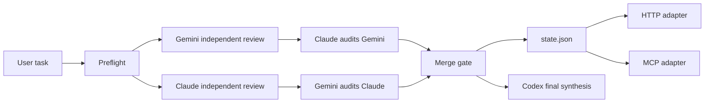

# Tri-party Framework

Verifiable Codex + Claude + Gemini collaboration for agent workflows.

This project prevents a common failure mode in AI-agent work: a single model claims to have used several models, but there is no source trail, no independent review, and no cross-audit. Tri-party Framework turns that into an executable workflow with source checks, archived model outputs, mutual audits, and a merge gate before synthesis.

Repository: https://github.com/r-design-j/tri-party-framework

Download ZIP: https://github.com/r-design-j/tri-party-framework/archive/refs/heads/main.zip

## What It Does

- Runs a preflight check for Codex, Claude, and Gemini availability.
- Collects independent Claude and Gemini review artifacts.
- Forces mutual cross-audit: Claude audits Gemini, Gemini audits Claude.
- Blocks final synthesis until the merge gate verifies source status, artifact metadata, completion markers, and hashes.
- Writes a machine-readable `state.json` for UI, HTTP, MCP, CI, or external adapters.
- Supports offline injection when Claude or Gemini output was collected manually.
- Provides HTTP and MCP adapters without changing the portable core truth.

## Why It Exists

Multi-agent work is useful only when the sources are real. If an agent cannot prove where each party's input came from, the result is not a true multi-model review.

Tri-party Framework makes this explicit:

- Codex owns implementation, repository work, tests, and final synthesis.
- Claude owns complex reasoning, architecture critique, and long-chain review.
- Gemini owns multimodal, URL, Google-context, and broad-context review.

Codex sub-agents do not count as Claude or Gemini.

## Quick Demo

Clone and validate the framework:

```bash
git clone https://github.com/r-design-j/tri-party-framework.git
cd tri-party-framework
chmod +x scripts/*.sh adapters/http/triparty_http_adapter.py adapters/mcp/triparty_mcp_adapter.py
scripts/triparty-lint.sh
```

Run the full workflow:

```bash
scripts/triparty.sh run "Review this repository for architecture, reliability, and user experience risks."
```

Check the latest state:

```bash
scripts/triparty.sh status
```

Expected output is written under:

```text
docs/framework/runs/review-YYYYMMDD-HHMMSS/
```

The important artifacts are:

```text
source-status.md
claude-review.md
gemini-review.md
claude-cross-audit.md
gemini-cross-audit.md
merge-status.md
state.json
```

The result is a true tri-party result only when `state.json` says:

```json
{
  "phase": "merged_ready",
  "true_triparty_ready": true,
  "conclusion": "Ready for true tri-party synthesis"
}
```

## Architecture



## Requirements

- Bash and Python 3.
- A Codex session for final synthesis.
- A direct Claude CLI/tool/API result, connector result, or user-provided Claude transcript.
- A direct Gemini CLI/tool/API result, connector result, or user-provided Gemini transcript.

The framework can still proceed in partial mode when a party is missing, but it must report the missing party and cannot claim `true_triparty_ready`.

## Trigger In A New Session

Use the canonical phrase when asking an agent to activate the framework:

```text
请使用 Codex + Claude + Gemini 三方模型协作框架处理这个任务：<任务>
```

Standalone phrases such as `三方框架` or `三方协议` are weak triggers. If the context also contains design components, registries, runtimes, third-party libraries, or other three-part structures, the agent should ask which one you mean before proceeding.

## Common Commands

Run a source check:

```bash
scripts/triparty.sh preflight
```

Run independent reviews:

```bash
scripts/triparty.sh review "Review the framework architecture, logic, and user experience."
```

Run mutual cross-audit:

```bash
scripts/triparty.sh cross-audit docs/framework/runs/review-YYYYMMDD-HHMMSS
```

Run the merge gate:

```bash
scripts/triparty.sh merge docs/framework/runs/review-YYYYMMDD-HHMMSS
```

List and inspect runs:

```bash
scripts/triparty.sh runs
scripts/triparty.sh stats
scripts/triparty.sh archive --keep 20 --dry-run
```

Use offline injection when Claude or Gemini output was collected manually:

```bash
scripts/triparty.sh inject review claude docs/framework/runs/review-YYYYMMDD-HHMMSS claude-output.md
scripts/triparty.sh inject review gemini docs/framework/runs/review-YYYYMMDD-HHMMSS gemini-output.md
scripts/triparty.sh resume docs/framework/runs/review-YYYYMMDD-HHMMSS
```

Injected artifacts are copied into the run directory, size-checked, hashed, and recorded in `state.json` with provenance details.

## Adapters

Start the local HTTP adapter:

```bash
python3 adapters/http/triparty_http_adapter.py --host 127.0.0.1 --port 8765
```

Read status through HTTP:

```bash
curl http://127.0.0.1:8765/status
```

The stdio MCP adapter is available at:

```text
adapters/mcp/triparty_mcp_adapter.py
```

Adapters are thin wrappers. They must read the portable core artifacts and must not mark a run as true tri-party unless `state.json` says `true_triparty_ready: true`.

## Examples

See [examples](examples/) for:

- A ready-to-run review prompt.
- Offline injection workflow.
- A sample `state.json` shape.

## Project Map

- `AGENTS.md`: stable working agreements inherited by future Codex sessions.
- `docs/framework/tri-party-protocol.md`: executable protocol and source rules.
- `docs/framework/adapter-contract.md`: rules every external adapter must obey.
- `docs/framework/model-binding.yaml`: current model-version binding for each role.
- `docs/framework/state.schema.json`: machine-readable run-state schema.
- `scripts/triparty.sh`: unified CLI for run, review, cross-audit, merge, status, resume, and archive.
- `scripts/triparty-preflight.sh`: source availability and connectivity probe.
- `scripts/triparty-review.sh`: Claude and Gemini independent review runner.
- `scripts/triparty-cross-audit.sh`: mutual Claude/Gemini audit runner.
- `scripts/triparty-merge.sh`: merge gate for source status, artifact metadata, completion markers, and hashes.
- `scripts/triparty-lint.sh`: framework consistency checks.
- `scripts/triparty-regression.sh`: historical failure-mode regression tests.
- `adapters/http/triparty_http_adapter.py`: local HTTP adapter.
- `adapters/mcp/triparty_mcp_adapter.py`: stdio MCP adapter.
- `docs/daily/`: daily summaries and reusable standard extraction.

## Good For

- Agent workflow teams that need auditable model collaboration.
- Developers comparing Claude and Gemini review outputs.
- Design or product teams that want source-labeled multi-model critique.
- Tool builders who need a portable core plus HTTP/MCP adapter surface.

## Not For

- Hiding single-model work behind multi-model language.
- Replacing direct model access with synthetic Codex sub-agent opinions.
- Running an unauthenticated network service. The HTTP adapter defaults to loopback for a reason.

## Contributing

Contributions are welcome. Start with [CONTRIBUTING.md](CONTRIBUTING.md), run `scripts/triparty-lint.sh`, and look for issues labeled `good first issue`.

## License

MIT. See [LICENSE](LICENSE).
