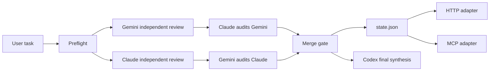

# Tri-party Framework

Verifiable Codex + Claude + Gemini collaboration for agent workflows.

This project prevents a common failure mode in AI-agent work: a single model claims to have used several models, but there is no source trail, no independent review, and no cross-audit. Tri-party Framework turns that into an executable workflow with source checks, archived model outputs, mutual audits, and a merge gate before synthesis.

Repository: https://github.com/r-design-j/tri-party-framework

Download ZIP: https://github.com/r-design-j/tri-party-framework/archive/refs/heads/main.zip

## What It Does

- Runs a preflight check for Codex, Claude, and Gemini availability.
- Collects independent Claude and Gemini review artifacts.
- Forces mutual cross-audit: Claude audits Gemini, Gemini audits Claude.
- Blocks final synthesis until the merge gate verifies source status, artifact metadata, completion markers, and hashes.
- Writes a machine-readable `state.json` with preflight binary evidence, provenance, Gemini diagnostics, and schema validation for UI, HTTP, MCP, CI, or external adapters.
- Provides a release gate that rechecks merge readiness, state shape, artifact hashes, automated provenance, and runtime-noise cleanliness before public release claims.
- Supports offline injection when Claude or Gemini output was collected manually.
- Provides HTTP and MCP adapters without changing the portable core truth.

## Why It Exists

Multi-agent work is useful only when the sources are real. If an agent cannot prove where each party's input came from, the result is not a true multi-model review.

Tri-party Framework makes this explicit:

- Codex owns implementation, repository work, tests, and final synthesis.
- Claude owns complex reasoning, architecture critique, and long-chain review.
- Gemini owns multimodal, URL, Google-context, and broad-context review.

Codex sub-agents do not count as Claude or Gemini.

## Quick Demo

Clone and validate the framework:

```bash
git clone https://github.com/r-design-j/tri-party-framework.git
cd tri-party-framework
chmod +x scripts/*.sh adapters/http/triparty_http_adapter.py adapters/mcp/triparty_mcp_adapter.py
scripts/triparty-lint.sh
```

Install the new-session bootstrap once on each machine:

```bash
scripts/install-triparty-global-bootstrap.sh
```

This writes global bootstrap blocks for Codex and Claude Code, installs Claude Code slash entrypoints `/triparty` and `/tp`, stores the framework home in `~/.triparty-framework/config`, and creates a `triparty` CLI wrapper in a user bin directory already on PATH when possible, such as `~/.npm-global/bin`. New sessions should use this installed framework instead of creating new Markdown files to reconstruct the protocol.

Run the full workflow:

```bash
scripts/triparty.sh run "Review this repository for architecture, reliability, and user experience risks."
```

When merge is ready, `run` also validates the release-level `state.json` contract so the default path catches schema, provenance, hash, and runtime-noise failures.
By default the release validator allows small recovered Gemini capacity blips, but blocks tool-call failures and capacity events above the configured threshold.

Check the latest state:

```bash
scripts/triparty.sh status
```

Expected output is written under:

```text
docs/framework/runs/review-YYYYMMDD-HHMMSS/
```

If the default `docs/framework/runs` directory is not writable, the portable core automatically falls back to `${TMPDIR:-/tmp}/triparty-runs`. `status` and `state.json` record the actual `run_dir` and `runs_dir`; do not infer location from the default path.

The important artifacts are:

```text
source-status.md
claude-review.md
gemini-review.md
claude-cross-audit.md
gemini-cross-audit.md
merge-status.md
state.json
```

The result is a true tri-party result only when `state.json` says:

```json
{
  "phase": "merged_ready",
  "true_triparty_ready": true,
  "conclusion": "Ready for true tri-party synthesis"
}
```

## Architecture



## Requirements

- Bash and Python 3.
- A Codex session for final synthesis.
- A direct Claude CLI/tool/API result, connector result, or user-provided Claude transcript.
- A direct Gemini CLI/tool/API result, connector result, or user-provided Gemini transcript.

The framework can still proceed in partial mode when a party is missing, but it must report the missing party and cannot claim `true_triparty_ready`.

Gemini preflight includes a separate headless auth doctor before any long review call. It reports one of `authenticated`, `interactive-auth-required`, `binary-missing`, or `timeout`; only `authenticated` proceeds to the normal Gemini probe.

## Trigger In A New Session

First make sure the bootstrap has been installed:

```bash
triparty preflight
```

Use the canonical phrase when asking an agent to activate the framework:

```text
请使用 Codex + Claude + Gemini 三方模型协作框架处理这个任务：<任务>
```

Standalone phrases such as `三方框架` or `三方协议` are weak triggers. If the context also contains design components, registries, runtimes, third-party libraries, or other three-part structures, the agent should ask which one you mean before proceeding.

Within an active Codex + Claude + Gemini workstream, follow-up requests such as "continue", "optimize", "publish", "release", or "fill this in" inherit the tri-party protocol unless the user explicitly asks for Codex-only execution.

If a new session cannot find the installed framework, it must report that discovery failed and ask whether to install or clone the repository. It must not create fresh protocol Markdown files as a substitute for the existing framework.

## Claude Code

Claude Code reads `CLAUDE.md`, not `AGENTS.md`. This repository includes `CLAUDE.md` to import `AGENTS.md`, and `scripts/install-triparty-global-bootstrap.sh` also writes a global `~/.claude/CLAUDE.md` bootstrap block. In Claude Code, use the same canonical trigger and then run the existing CLI:

```bash
triparty status
triparty run "你的任务"
```

The installer also installs Claude Code slash entrypoints, so a new Claude Code session can invoke the framework directly:

```text
/triparty status
/triparty preflight
/triparty run "请用 Codex + Claude + Gemini 三方模型协作框架审查这个方案"
/tp status
```

Slash invocation is an adapter surface, not the framework core. If a different agent does not support Claude Code slash skills or slash commands, use the portable `triparty` CLI, HTTP adapter, or MCP adapter instead.

## Common Commands

Run a source check:

```bash
scripts/triparty.sh preflight
```

Run only the Gemini auth doctor:

```bash
scripts/triparty-gemini-auth-doctor.sh
```

Run independent reviews:

```bash
scripts/triparty.sh review "Review the framework architecture, logic, and user experience."
```

Run mutual cross-audit:

```bash
scripts/triparty.sh cross-audit docs/framework/runs/review-YYYYMMDD-HHMMSS
```

Run the merge gate:

```bash
scripts/triparty.sh merge docs/framework/runs/review-YYYYMMDD-HHMMSS
```

Run the release gate before public push/release claims:

```bash
scripts/triparty.sh release-gate docs/framework/runs/review-YYYYMMDD-HHMMSS
```

The release gate is conservative: a run is partial unless both Claude and Gemini have complete independent review artifacts and complete cross-audit artifacts with valid metadata, hashes, completion markers, and clean runtime output.

Validate a state file directly:

```bash
scripts/triparty-validate-state.py --release docs/framework/runs/review-YYYYMMDD-HHMMSS/state.json
```

Create and verify a local cross-session handoff:

```bash
scripts/triparty.sh continuity checkpoint --run-dir docs/framework/runs/review-YYYYMMDD-HHMMSS
scripts/triparty.sh continuity bootstrap
```

The continuity checkpoint writes `.agent/continuity/current.yml`, `handoff.md`, `bootstrap.md`, `manifest.json`, and redaction rules. The bootstrap command verifies manifest hashes before printing the handoff; it does not upgrade a partial run into a true tri-party conclusion.

Optional local pre-push hook:

```bash
scripts/install-triparty-git-hooks.sh
```

List and inspect runs:

```bash
scripts/triparty.sh runs
scripts/triparty.sh stats
scripts/triparty.sh archive --keep 20 --dry-run
```

Use offline injection when Claude or Gemini output was collected manually:

```bash
scripts/triparty.sh inject review claude docs/framework/runs/review-YYYYMMDD-HHMMSS claude-output.md
scripts/triparty.sh inject review gemini docs/framework/runs/review-YYYYMMDD-HHMMSS gemini-output.md
scripts/triparty.sh resume docs/framework/runs/review-YYYYMMDD-HHMMSS
```

Injected artifacts are copied into the run directory, size-checked, hashed, and recorded in `state.json` with provenance details.

## Adapters

Start the local HTTP adapter:

```bash
python3 adapters/http/triparty_http_adapter.py --host 127.0.0.1 --port 8765
```

Read status through HTTP:

```bash
curl http://127.0.0.1:8765/status
```

The stdio MCP adapter is available at:

```text
adapters/mcp/triparty_mcp_adapter.py
```

Adapters are thin wrappers. They must read the portable core artifacts and must not mark a run as true tri-party unless `state.json` says `true_triparty_ready: true`.

## Examples

See [examples](examples/) for:

- A ready-to-run review prompt.
- Offline injection workflow.
- A sample `state.json` shape.
- Failure recovery for timeout, capacity, or partial-state runs.

## Project Map

- `AGENTS.md`: stable working agreements inherited by future Codex sessions.
- `CLAUDE.md`: Claude Code entrypoint that imports `AGENTS.md`.
- `.claude/skills/triparty/SKILL.md`: Claude Code `/triparty` slash skill.
- `.claude/commands/`: fallback Claude Code slash command files, including `/triparty` and `/tp`.
- `docs/framework/tri-party-protocol.md`: executable protocol and source rules.
- `docs/framework/adapter-contract.md`: rules every external adapter must obey.
- `docs/framework/model-binding.yaml`: current model-version binding for each role.
- `docs/framework/state.schema.json`: machine-readable run-state schema.
- `RELEASE_CHECKLIST.md`: public release readiness gate.
- `SECURITY.md`: adapter, artifact, and source-truth safety notes.
- `scripts/triparty.sh`: unified CLI for run, review, cross-audit, merge, status, resume, and archive.
- `scripts/triparty-preflight.sh`: source availability and connectivity probe.
- `scripts/triparty-runs-dir.sh`: writable run-directory resolver with temp fallback.
- `scripts/triparty-gemini-auth-doctor.sh`: fast Gemini headless-auth classifier.
- `scripts/triparty-review.sh`: Claude and Gemini independent review runner.
- `scripts/triparty-cross-audit.sh`: mutual Claude/Gemini audit runner.
- `scripts/triparty-merge.sh`: merge gate for source status, artifact metadata, completion markers, and hashes.
- `scripts/triparty-release-gate.sh`: public push/release readiness gate backed by `state.json`.
- `scripts/triparty-validate-state.py`: dependency-free state and release-readiness validator.
- `scripts/triparty-continuity-checkpoint.sh`: local cross-session handoff writer.
- `scripts/triparty-continuity-bootstrap.sh`: manifest-verified handoff bootstrap printer.
- `scripts/install-triparty-git-hooks.sh`: optional local pre-push hook installer for the release gate.
- `scripts/install-triparty-global-bootstrap.sh`: installs global new-session discovery, config, and CLI wrapper.
- `scripts/triparty-lint.sh`: framework consistency checks.
- `scripts/triparty-regression.sh`: historical failure-mode regression tests.
- `adapters/http/triparty_http_adapter.py`: local HTTP adapter.
- `adapters/mcp/triparty_mcp_adapter.py`: stdio MCP adapter.
- `docs/daily/`: daily summaries and reusable standard extraction.

## Good For

- Agent workflow teams that need auditable model collaboration.
- Developers comparing Claude and Gemini review outputs.
- Design or product teams that want source-labeled multi-model critique.
- Tool builders who need a portable core plus HTTP/MCP adapter surface.

## Not For

- Hiding single-model work behind multi-model language.
- Replacing direct model access with synthetic Codex sub-agent opinions.
- Running an unauthenticated network service. The HTTP adapter defaults to loopback for a reason.

## Contributing

Contributions are welcome. Start with [CONTRIBUTING.md](CONTRIBUTING.md), run `scripts/triparty-lint.sh`, and look for issues labeled `good first issue`.

## License

MIT. See [LICENSE](LICENSE).
