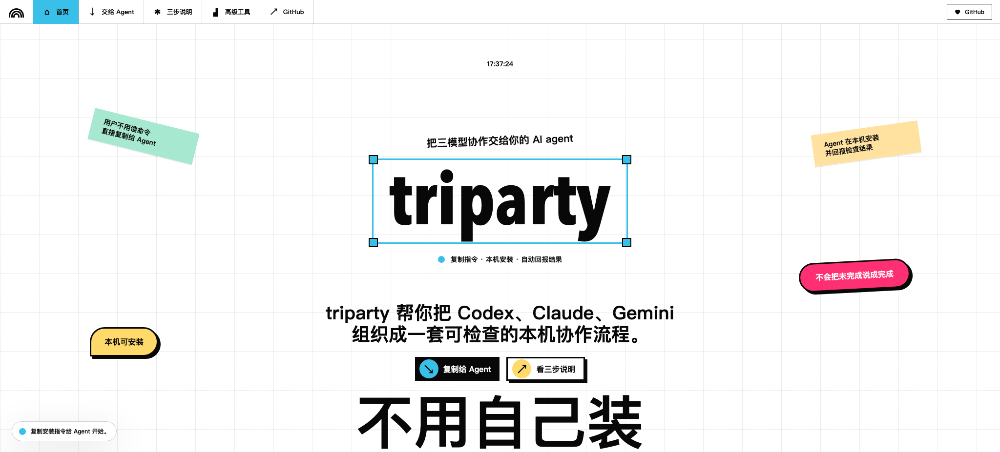

# AgentParty / triparty 工具台

这是 AgentParty 通用多 agent 协作协议的静态工具台。`AgentParty` 是底层框架 / 协议层，当前网站下挂两个产品化产物：`triparty` 是已经产品化的 Codex + Claude + Gemini 官方三方产品包；`Claude Code + Feishu Claw` 是面向 Claude Code 和飞书小龙虾 Claw 协作的 2-agent 产品包脚手架，并已支持 transcript / 飞书链接 / 操作摘要 / Claude 复核的证据导入和 pack-state 验证。正文默认中文，CLI、Python、HTTP/MCP、state.json 等专有名词保留英文。

macOS 直接打开：

```bash
open web/index.html
```

也可以启动本地服务：

```bash
python3 -m http.server 4187 --bind 127.0.0.1 --directory web
```

然后访问 `http://127.0.0.1:4187`。

公开访问地址：

https://r-design-j.github.io/tri-party-framework/



当前阶段页面刻意保持静态。默认视图面向普通用户：先解释 `AgentParty` 底层协议，再展示 `triparty` 与 `Claude Code + Feishu Claw` 两个产品包，并提供可直接交给 AI agent 的 `triparty` 安装委托、终端命令和 Claw 产品包委托。Claw pack 还提供 Claude Code `/agentparty-claw` 与 `/ap-claw` slash adapter，用于创建/检查本地 handoff kit；如果找不到 AgentParty CLI 或框架配置，slash adapter 必须停止并报告未安装，不能自造协议文件。状态检查、CLI 命令、失败恢复、案例详情和接入清单被折叠在“高级工具与排查台”里，供安装失败、开发接入或需要核验 true / partial 时使用。

层级关系：

- `AgentParty Protocol`：通用多 agent 协作协议，目标是支持任意两个以上 agent、角色绑定、证据链、审计拓扑和 complete / partial 门禁。
- `triparty product pack`：AgentParty 下的官方三方产品包，固定绑定 Codex + Claude + Gemini。
- `Claude Code + Feishu Claw product pack`：AgentParty 下的 2-agent 产品包脚手架，面向 Claude Code 和飞书小龙虾 Claw 的 transcript / 文档证据协作，可通过 CLI 或 Claude Code `/agentparty-claw` slash adapter 生成本地 kit，可导入证据后得到 pack_ready / partial / blocked / scoped，不能声称 true tri-party。
- `triparty run`：一次具体运行，必须通过 preflight、review、cross-audit、merge 和 release gate 后才能声称 true triparty。
- `adapter`：CLI、HTTP、MCP、手工 transcript 等接入面，只能读取或调用核心流程，不能自造完成结论。

安装边界：当前 `triparty` 产品包推荐在 macOS、Linux、Windows WSL2 中安装；Windows 原生 PowerShell/CMD/Git Bash/MSYS/Cygwin 方案仍在 AgentParty 通用层路线中，尚未完成时不要硬跑 bash 脚本。

Windows 安装方案：

- 当前可执行：Windows WSL2 + Ubuntu。进入 WSL2 后按 Linux 流程执行 `git clone`、`chmod +x scripts/*.sh`、`scripts/triparty-lint.sh`、`scripts/agentparty.sh install --pack triparty --target-os auto`、`scripts/agentparty.sh install --pack triparty --target-os auto --execute`、`triparty preflight`。
- 原生 PowerShell 当前只建议做环境准备、检查、quickstart、安装 dry-run、安装计划、prompt、guide、validate-run、evidence-template、evidence-fill 和 package 准备：`winget install Git.Git`、`winget install Python.Python.3.12`、`.\scripts\agentparty.ps1 install --pack triparty --target-os windows_powershell`，然后进入 WSL2 跑 triparty。
- AgentParty CLI：当前仓库提供 Python 版 `scripts/agentparty.sh packs/doctor/quickstart/install/install-plan/release-check/package/prompt/kit/run/guide/evidence-template/evidence-fill/evidence/validate-run` scaffold；`scripts/agentparty.ps1` 只作为发现 / doctor / quickstart / install dry-run / install-plan / prompt / guide / validate-run / kit / evidence-template / evidence-fill / package 兼容 scaffold，Windows 非 WSL shell 下的 `install --execute`、`run`、`doctor --deep` 和 `evidence` 会被阻断。PowerShell 原生一键化仍是路线，不是已验证 Windows 发布承诺。
- 当前 PowerShell 证据只代表静态 / regression / package 边界检查；没有单独 Windows 真机 run 记录时，不得写成已验证原生 Windows 执行。
- 执行安装时，`--target-os` 必须匹配当前真实主机；dry-run 可以看其他系统计划，但 `--execute` 请在目标机器内用 `--target-os auto`。
- 回滚路径：`scripts/uninstall-triparty-global-bootstrap.sh --dry-run` 或 `.\scripts\uninstall-triparty-global-bootstrap.ps1 -DryRun` 先列出会删除的 managed artifacts，再用显式 execute 删除。安装会写入 `managed-install.env` 记录 managed 文件 hash；用户改过的 slash/skill 文件会跳过。详细生命周期证据见 `docs/framework/agentparty-managed-install-lifecycle.md`。

本地安装：

如果用户不想自己看步骤，可以直接把这段话复制给能操作本机终端的 AI agent：

```text
请在这台机器上安装 triparty。
目标仓库：https://github.com/r-design-j/tri-party-framework
执行要求：
先判断系统环境：macOS / Linux / Windows WSL2 可按当前流程执行；Windows 原生 PowerShell/CMD 目前只做环境准备和检查，不要硬跑 bash 脚本，请引导进入 WSL2 或等待 PowerShell 原生 AgentParty CLI 路线完成。
1. clone 仓库并进入目录。
2. 补齐必要脚本权限。
3. 运行项目自检。
4. 安装全局发现规则和 triparty 命令。
5. 运行 triparty preflight 验证。
6. 如果缺少 Claude Code、Gemini CLI、认证或权限，请明确报告缺失项；不要把 partial run / 未完成协作说成 true tri-party / 完整三方。
完成后告诉我本机安装路径和 preflight 结果。
```

```bash
# 适用 macOS / Linux / Windows WSL2；PowerShell 原生路线仍在 AgentParty 通用层中。
git clone https://github.com/r-design-j/tri-party-framework.git
cd tri-party-framework
chmod +x scripts/*.sh adapters/http/triparty_http_adapter.py adapters/mcp/triparty_mcp_adapter.py
scripts/triparty-lint.sh
scripts/agentparty.sh install --pack triparty --target-os auto
scripts/agentparty.sh install --pack triparty --target-os auto --execute
triparty preflight
open web/index.html
```

已实现交互：

- 首页主按钮复制给 AI agent 的安装委托。
- 首页产品入口新增 `agentparty onboard --pack triparty --target-os auto`，把 OS 边界、安装、preflight、首次运行和 release gate 收敛成一个产品化上手面。
- “给 Agent 的安装指令”同时提供 `triparty` 自然语言委托、终端命令和 `Claude Code + Feishu Claw` 产品包委托，三者都可复制。
- 高级工具区提供 `agentparty install` 和 `agentparty install-plan` 命令，帮助 macOS/Linux/WSL2/Windows PowerShell 用户得到边界安全的安装路径；安装执行必须显式 `--execute`。
- 高级工具区提供 `agentparty info --pack ...`，让用户先查看 `triparty` 和 `Claude Code + Feishu Claw` 的角色、ready label、OS 边界和文档入口。
- 高级工具区提供 `agentparty package --out dist/agentparty-release --archive`，生成只读 release bundle、安装说明和带 sha256 的 manifest；它是分发表面，不执行模型、不写全局安装，也不把 PowerShell 原生执行或 Feishu Claw 自动认证写成已完成。
- 维护者发布物由 `.github/workflows/agentparty-release.yml` 生成：Ubuntu/macOS 跑完整 release-check 并上传 package bundle；Windows job 支持 PowerShell 只读 package 分发表面，并验证 `E_BLOCKED_OS` 阻断，不代表原生执行已发布。
- 高级工具区提供 bash / PowerShell uninstall dry-run 命令，帮助用户先审计再回滚全局 bootstrap。
- “高级工具与排查台”默认折叠，顶部导航或展开按钮可打开。
- 安装后检查支持粘贴 `state.json` 并检查 JSON 有效性、true_triparty_ready、Gemini auth、review / cross-audit 和 errors。
- 命令卡片都能复制真实 CLI 命令，包括 triparty release gate、AgentParty onboard、AgentParty quickstart、AgentParty release-check、AgentParty package、Claw kit、Claw evidence-template、Claw bundle import、AgentParty validate-run 和 AgentParty guide；`agentparty release-check` 会校验这些命令卡的结构和 copy 命令。Claw kit 现在生成 `START_HERE.md` 作为普通用户第一入口，固定复制顺序、证据清单、`evidence-fill` 本地填包提示、导入命令和边界。
- UI 前置 checklist 会更新完成度、下一步提示和进度条，并标记 Claw ready / partial / blocked 样例已经覆盖。
- 每个案例卡片都跳转到自己的详情卡，不是装饰链接。
- 排查工具会生成 shell-safe 单引号命令，避免 `$(...)` 被 shell 展开。
- 错误恢复路由会根据错误码给出下一条恢复动作。
- 桌面和移动端都有状态反馈 toast。

页面结构覆盖：

- 首页：说明 `AgentParty` 是底层框架，`TriParty` 是官方三方产品包，并把主要动作收敛成“复制给 Agent / onboard / 安装 TriParty”。
- 层级说明：解释 AgentParty、triparty 产品包、run state、adapter 的关系。
- AgentParty section：解释母框架协议对象、triparty 产品包、2-agent partial preset、state schema 演进和未完成边界。
- Product packs section：并列展示 `triparty` 与 `Claude Code + Feishu Claw`，明确前者可 true tri-party、后者通过 guide / evidence-template / evidence-fill / evidence / validate-run 只能得到 pack-ready / partial / blocked。
- Windows section：给出 WSL2 当前安装路径、PowerShell 环境检查路径和 AgentParty CLI 产品化路线。
- 普通用户说明：解释用户、agent、网页各自负责什么，并避免把探针成功说成完整协作。
- 给 Agent 的安装指令：提供可复制的 `triparty` 自然语言安装委托、终端命令和 `Claude Code + Feishu Claw` pack 委托。
- 三步说明：用“拉取项目 / 写入规则 / 回报结果”解释安装过程。
- 高级工具与排查台：默认折叠，保留安装后检查、命令卡片、Claw 证据导入命令、证据案例、排查工具和开发者接入。
- 安装后检查：粘贴 `state.json` 后判断 true / partial。
- 可信证据：展示运行状态检查、发布前检查、失败恢复、本地服务接入四个产品化模块。
- 排查工具：提供命令生成器和错误恢复建议。
- 开发者接入：列出 contract、fixtures、只读本地服务接入工作。
